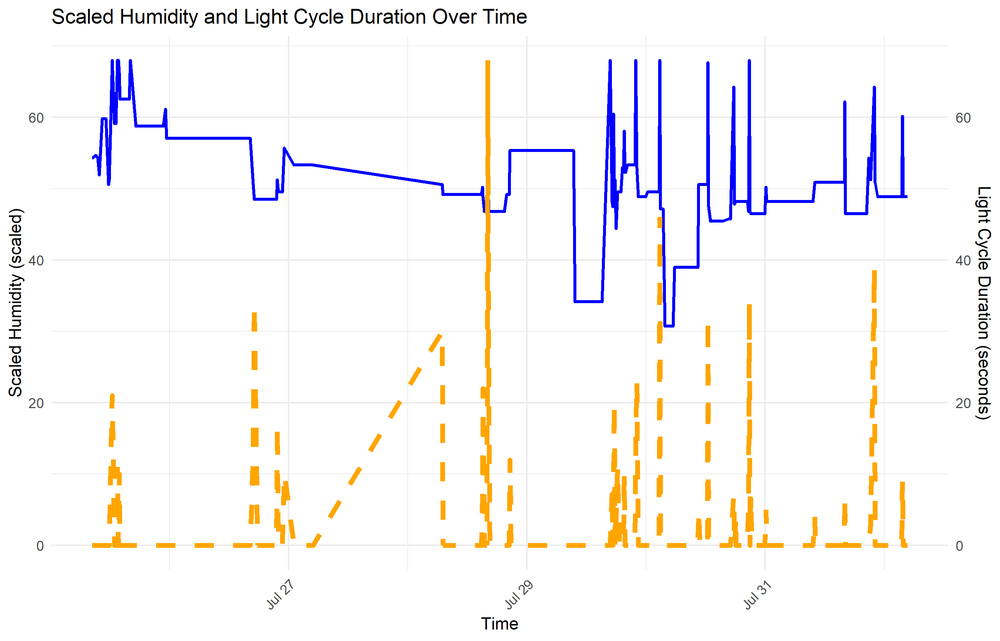
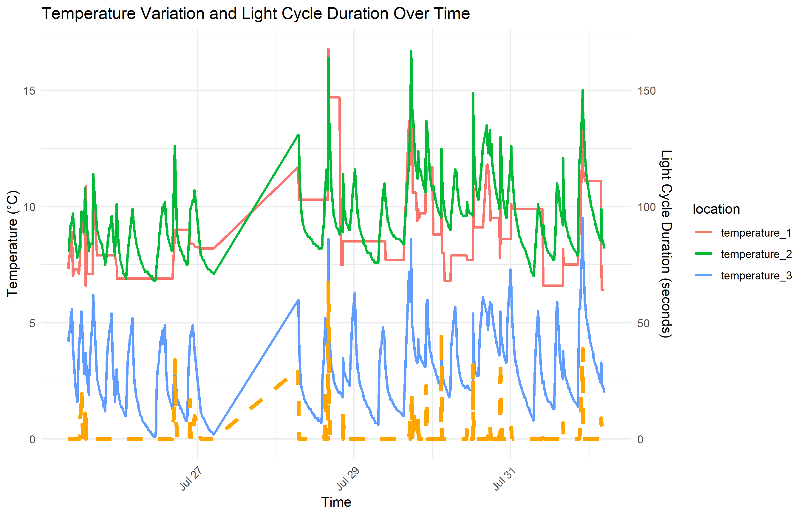
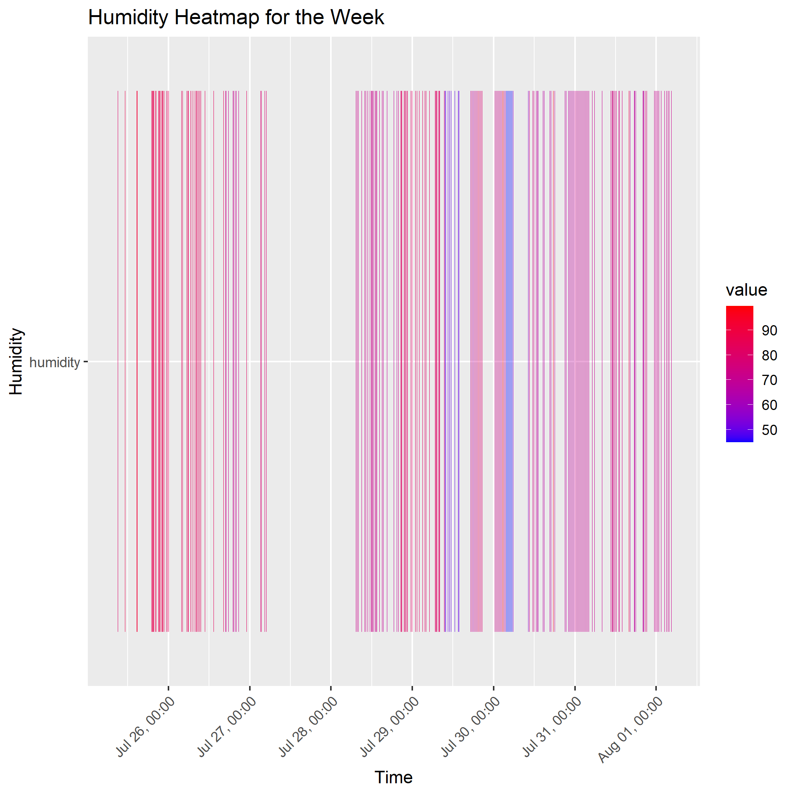
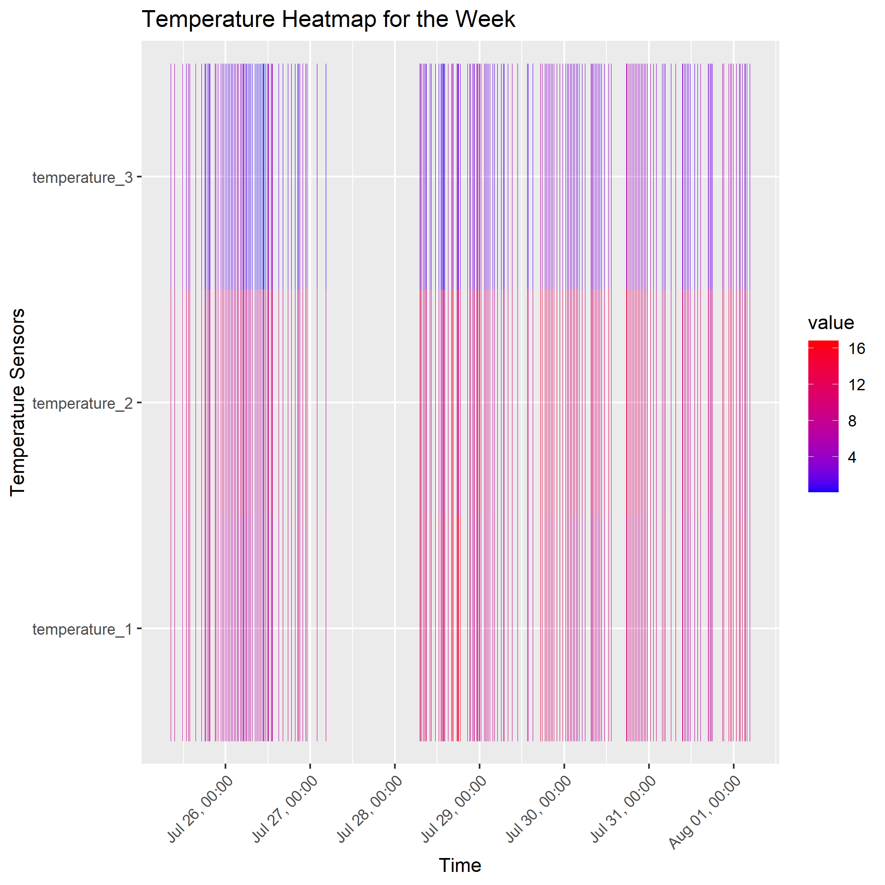

<<<<<<< HEAD
# OCTOPUS
## Multi-sensor-refrigerator-parameter-monitoring-system

## Overview
This project implements an advanced multi-sensor system for monitoring refrigerator conditions using IoT technology. It employs HDC1080 temperature and humidity sensors, LoRaWAN communication, and cloud-based data processing and visualization.

## Hardware Components
- Arduino MKR WAN 1310 processor board
- Three HDC1080 temperature and humidity sensors
- Photoresistor for door status detection
- Lithium battery for power supply
- LoRaWAN communication module

## Software Components
- Node.js script for cloud integration
- MQTT for data transmission
- InfluxDB for data storage
- Grafana for data visualization

## System Architecture
1. **Data Acquisition**: HDC1080 sensors collect temperature and humidity data at predetermined intervals.
2. **LoRaWAN Transmission**: Data is transmitted to The Things Network (TTN).
3. **Cloud Processing**: A Node.js script receives data from TTN via MQTT.
4. **Data Storage**: Processed data is stored in InfluxDB.
5. **Visualization**: Grafana provides real-time dashboards and analysis.

## Installation
1. Set up the hardware components in the refrigerator according to the 3D grid pattern specified in the methodology.
2. Configure the Arduino MKR WAN 1310 with the provided code in Arduino file folder.
3. Set up a TTN account and configure your device.
4. Deploy the Node.js script in Node file folder on your server.
5. Install and configure InfluxDB.
6. Set up Grafana.

## Usage
- The system automatically collects and transmits data at optimized intervals.
- Access the Grafana dashboard for real-time monitoring and analysis.
- Adjust transmission intervals and sensor configurations as needed for your specific use case.

## Data Analysis

This multi-sensor refrigerator monitoring system provides rich datasets for in-depth analysis of refrigerator performance and environmental conditions. Here are key insights derived from the data:

### 1. Temperature Variation

- The system monitors temperature at three different locations (temperature_1, temperature_2, temperature_3).
- Temperature ranges observed: 0°C to 16°C across all sensors.
- Temperature_2 consistently shows higher readings, possibly indicating its proximity to a heat source or less efficient cooling area.
- Daily temperature fluctuations are evident, likely correlating with door openings and ambient room temperature changes.

### 2. Humidity Patterns

- Humidity levels range from approximately 50% to 90%.
- The heatmap reveals consistent high humidity (red areas) interspersed with periods of lower humidity (blue areas).
- Sudden drops in humidity may indicate door openings or the introduction of new items into the refrigerator.

### 3. Light Cycle Duration

- Light cycle data provides insights into refrigerator usage patterns.
- Short, sporadic light cycles (visible as orange spikes in Images 1 and 2) indicate brief door openings.
- Longer light cycles may suggest extended door openings or maintenance activities.

### 4. Correlations

- Temperature and humidity show an inverse relationship – as temperature increases, humidity tends to decrease.
- Light cycles often correlate with temporary increases in temperature and decreases in humidity, confirming the impact of door openings on the internal environment.

### 5. Time-based Patterns

- The data spans from July 26 to August 1, allowing for weekly pattern analysis.
- Daily rhythms are observable, with more frequent door openings (light cycles) during daytime hours.

### 6. Sensor Comparison

- Temperature_3 consistently shows the lowest readings, suggesting it might be placed in the coldest part of the refrigerator.
- The difference between temperature sensors helps identify temperature gradients within the refrigerator, useful for optimal food storage placement.

This analysis provides valuable insights into refrigerator performance, usage patterns, and potential areas for energy efficiency improvements. The multi-sensor approach allows for a comprehensive understanding of the refrigerator's internal environment and its responses to external factors.

## Acknowledgments
- Texas Instruments for the HDC1080 sensor
- The Things Network for LoRaWAN infrastructure
- (Any other acknowledgments)
=======
# Getting Started with Create React App

This project was bootstrapped with [Create React App](https://github.com/facebook/create-react-app).

## Available Scripts

In the project directory, you can run:

### `npm start`

Runs the app in the development mode.\
Open [http://localhost:3000](http://localhost:3000) to view it in your browser.

The page will reload when you make changes.\
You may also see any lint errors in the console.

### `npm test`

Launches the test runner in the interactive watch mode.\
See the section about [running tests](https://facebook.github.io/create-react-app/docs/running-tests) for more information.

### `npm run build`

Builds the app for production to the `build` folder.\
It correctly bundles React in production mode and optimizes the build for the best performance.

The build is minified and the filenames include the hashes.\
Your app is ready to be deployed!

See the section about [deployment](https://facebook.github.io/create-react-app/docs/deployment) for more information.

### `npm run eject`

**Note: this is a one-way operation. Once you `eject`, you can't go back!**

If you aren't satisfied with the build tool and configuration choices, you can `eject` at any time. This command will remove the single build dependency from your project.

Instead, it will copy all the configuration files and the transitive dependencies (webpack, Babel, ESLint, etc) right into your project so you have full control over them. All of the commands except `eject` will still work, but they will point to the copied scripts so you can tweak them. At this point you're on your own.

You don't have to ever use `eject`. The curated feature set is suitable for small and middle deployments, and you shouldn't feel obligated to use this feature. However we understand that this tool wouldn't be useful if you couldn't customize it when you are ready for it.

## Learn More

You can learn more in the [Create React App documentation](https://facebook.github.io/create-react-app/docs/getting-started).

To learn React, check out the [React documentation](https://reactjs.org/).

### Code Splitting

This section has moved here: [https://facebook.github.io/create-react-app/docs/code-splitting](https://facebook.github.io/create-react-app/docs/code-splitting)

### Analyzing the Bundle Size

This section has moved here: [https://facebook.github.io/create-react-app/docs/analyzing-the-bundle-size](https://facebook.github.io/create-react-app/docs/analyzing-the-bundle-size)

### Making a Progressive Web App

This section has moved here: [https://facebook.github.io/create-react-app/docs/making-a-progressive-web-app](https://facebook.github.io/create-react-app/docs/making-a-progressive-web-app)

### Advanced Configuration

This section has moved here: [https://facebook.github.io/create-react-app/docs/advanced-configuration](https://facebook.github.io/create-react-app/docs/advanced-configuration)

### Deployment

This section has moved here: [https://facebook.github.io/create-react-app/docs/deployment](https://facebook.github.io/create-react-app/docs/deployment)

### `npm run build` fails to minify

This section has moved here: [https://facebook.github.io/create-react-app/docs/troubleshooting#npm-run-build-fails-to-minify](https://facebook.github.io/create-react-app/docs/troubleshooting#npm-run-build-fails-to-minify)
>>>>>>> Initialize project using Create React App
